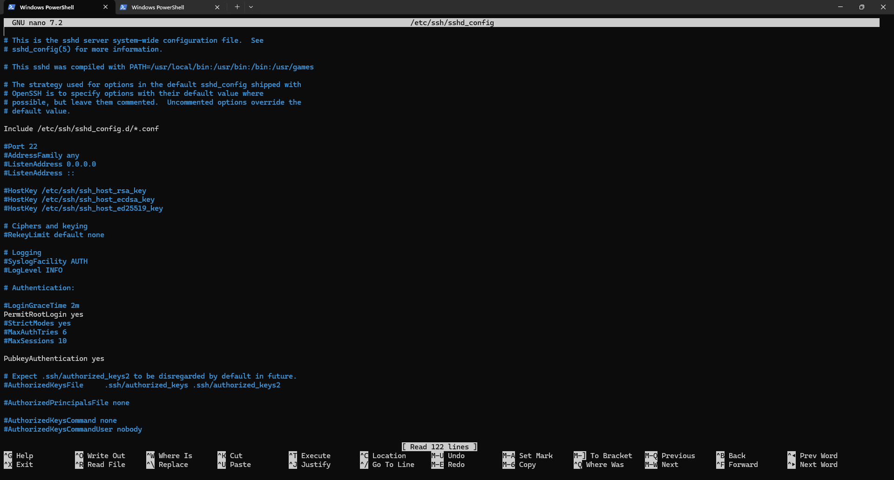

# Docker 28.3.3 Configuration

## Introduction
This document provides post-installation configuration steps for Docker 28.3.3 on a Debian 12.11 VM. It includes service hardening, logging setup, and enabling user access.

## Prerequisites
- Docker installed and verified
- Root or sudo access
- Internet access for package updates

## Step 1 – Enable and configure Docker daemon

```bash
systemctl enable docker
systemctl start docker
```

Ensure Docker is enabled on boot and running.




## Step 2 – Allow non-root user access

Add your user to the Docker group:

```bash
usermod -aG docker <username>
```

Log out and log back in for group changes to take effect.


## Step 3 – Configure Docker daemon JSON

Edit or create the daemon config:

```bash
nano /etc/docker/daemon.json
```

Example:

```json
{
  "log-driver": "journald",
  "storage-driver": "overlay2"
}
```

Then restart Docker:

```bash
systemctl restart docker
```

## Validation and tests

```bash
docker info
```

Check for correct storage and logging configuration.

## Common Issues

| Symptom | Cause | Fix |
|--------|--------|-----|
| `Got permission denied` | Group change not applied | Logout/login or `newgrp docker` |
| Daemon config ignored | Syntax error in JSON | Validate with `jq .` or similar |

## Next steps

Proceed to [network.md](network.md) for interface bindings and firewall configuration.
