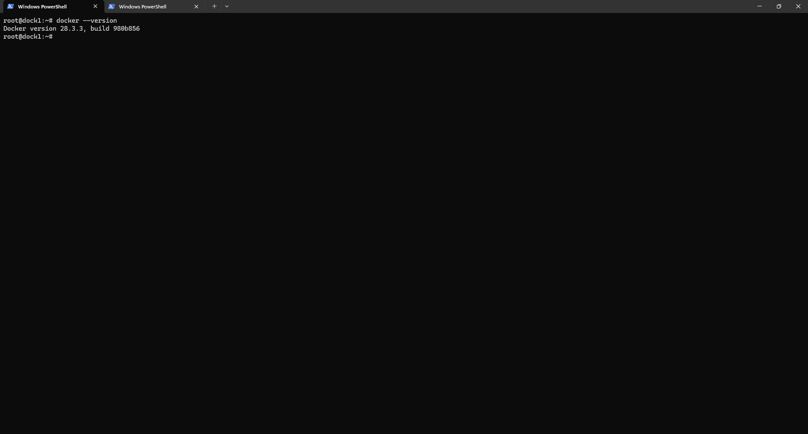

# Docker 28.3.3 Installation on Debian 12.11 (VM)

## Introduction
This guide details the complete installation process of Docker version 28.3.3 on a Debian 12.11 virtual machine deployed on Proxmox VE. It includes SSH access configuration for root and necessary post-installation tasks to ensure a clean, functional Docker environment.

## Prerequisites
- A Debian 12.11 (netinst) VM installed on Proxmox VE
- Minimum 2 vCPU, 2 GB RAM, 10 GB disk
- Proxmox bridged network or VLAN assigned
- Static IP assigned or DHCP reservation
- Console or SSH access to the VM
- Verified download links:
  - Debian ISO: [✔ verified https://www.debian.org/distrib/netinst]
  - Docker install docs: [✔ verified https://docs.docker.com/engine/install/debian/]

## Step 1 – Enable root SSH access

Edit the sshd_config file:

```bash
nano /etc/ssh/sshd_config
```

Uncomment and set:

```text
PermitRootLogin yes
```

Then restart SSH:

```bash
systemctl restart ssh
```




## Step 2 – Install Docker from official repository

```bash
apt update && apt install -y ca-certificates curl gnupg
install -m 0755 -d /etc/apt/keyrings
curl -fsSL https://download.docker.com/linux/debian/gpg | gpg --dearmor -o /etc/apt/keyrings/docker.gpg
echo   "deb [arch=$(dpkg --print-architecture)   signed-by=/etc/apt/keyrings/docker.gpg]   https://download.docker.com/linux/debian   bookworm stable" | tee /etc/apt/sources.list.d/docker.list > /dev/null
apt update
apt install -y docker-ce docker-ce-cli containerd.io docker-buildx-plugin docker-compose-plugin
```

This installs Docker 28.3.3 and its CLI components from the official source.

## Validation and tests

```bash
docker --version
```

Expected output:
```
Docker version 28.3.3, build xxxxxxx
```

```bash
docker run hello-world
```

Should print confirmation that Docker works correctly.

## Common Issues

| Symptom | Cause | Fix |
|--------|--------|-----|
| `Permission denied` using Docker | Missing group | Run `usermod -aG docker <user>` and relogin |
| SSH root login rejected | `PermitRootLogin` still disabled | Re-edit `/etc/ssh/sshd_config` and restart service |

## Next steps

Proceed to [configuration.md](configuration.md) for Docker service tweaks and container logging options.
