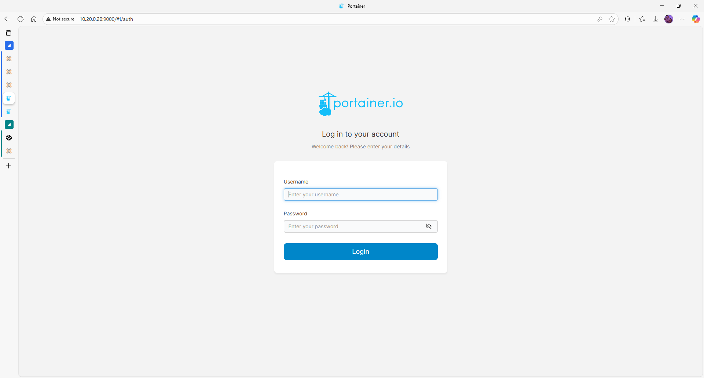
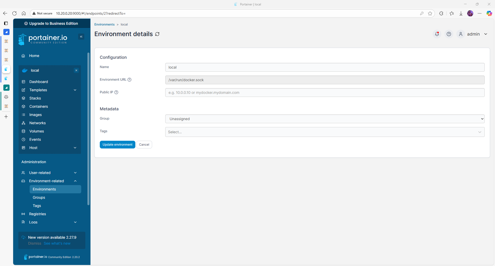
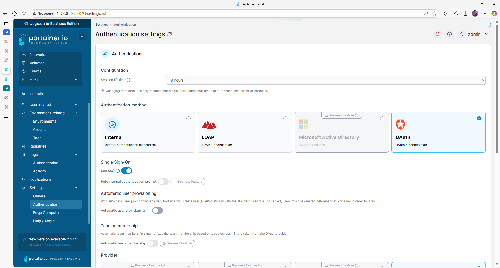
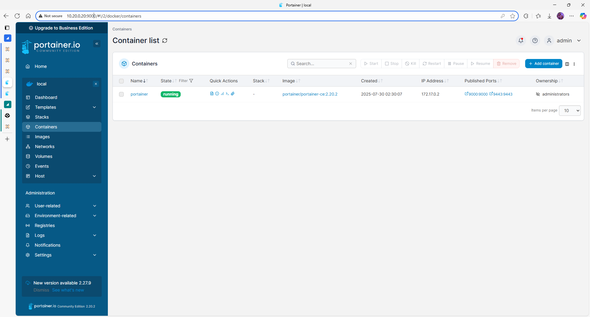

# Portainer Configuration

## Introduction

This document describes the initial configuration of Portainer once deployed, including admin setup, Docker environment binding, and authentication settings.

## Prerequisites

- Docker must be running on the VM
- Portainer container running and accessible (default port: `9443`)
- Firewall ports open (refer to [network.md](network.md))

## Step 1 – Access Portainer Web UI

1. Open browser and visit `https://<dock1|dock2 IP>:9443`
2. Accept TLS warning (self-signed cert)
3. Create **admin** user and password

## Step 2 – Bind Docker environment

| Option           | Value                       |
|------------------|-----------------------------|
| Environment type | Local                       |
| URL              | unix:///var/run/docker.sock |

This allows Portainer to control the local Docker engine.

## Step 3 – Enable Authentication Options

- Navigate to **Settings → Authentication**
- Optionally enable OAuth, LDAP or SSO
- Set session timeout and password policies

## GUI Reference Table

| Menu path                  | Action                        | Purpose                     |
|----------------------------|-------------------------------|-----------------------------|
| Environments → Local       | View Docker container status  | Monitor local engine        |
| Settings → Authentication  | Configure login rules         | Improve access security     |
| Settings → App Templates   | Customize stack templates     | Add private templates       |

## Validation and tests

- Deploy a test container from the UI
- Navigate container logs, stats, console
- Confirm login/logout cycles and session timeout

## Common Issues

| Symptom                        | Cause                      | Fix                                               |
|-------------------------------|-----------------------------|----------------------------------------------------|
| UI not loading on port 9443   | Port closed or service down | Verify Docker logs, check firewall rules           |
| Cannot see Docker containers  | Missing socket mount        | Add `-v /var/run/docker.sock:/var/run/docker.sock` |
| Authentication loop           | Browser cache               | Clear cookies or use private window                |

## Next steps

Proceed to [features.md](features.md) to explore container, stack and user management features.
