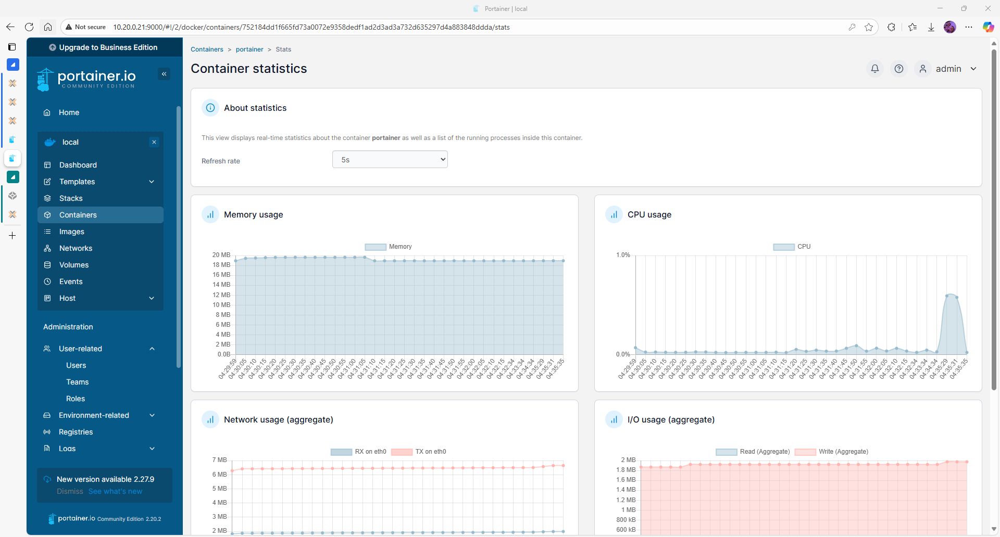

# Portainer Key Features

## Overview

Portainer provides a lightweight yet powerful UI to manage Docker environments. Below is a summary of its main capabilities in the current deployment.

## Feature Matrix

| Feature           | Available | Notes                                 |
|------------------|-----------|----------------------------------------|
| Container GUI     | ✅         | Create, start, stop, delete containers |
| Image management  | ✅         | Pull, tag, delete images               |
| Volume & Network  | ✅         | Create Docker volumes/networks         |
| Stack support     | ✅         | Deploy via Compose (manual upload)     |
| Registry auth     | ✅         | Supports DockerHub and private repos   |
| Role-based users  | ✅         | Only with Portainer Business Edition   |
| Resource control  | 🔶         | Basic; advanced needs license          |

## Dashboard

## Container Management

You can inspect logs, stats, and console access:

## Stack Deployment

Deploy multi-container stacks via Compose (YAML upload or text input):

## Authentication and User Roles

Configure access policies:

## Recommended Usage

- Use **Stacks** for production deployments  
- Leverage **Users & Teams** for shared environments  
- Mount `/var/run/docker.sock` carefully in shared setups

## Next steps

- Consider connecting multiple endpoints (dock1 + dock2)
- Explore Portainer Agent for centralized control

Official documentation: [✔ verified https://docs.portainer.io](https://docs.portainer.io)
