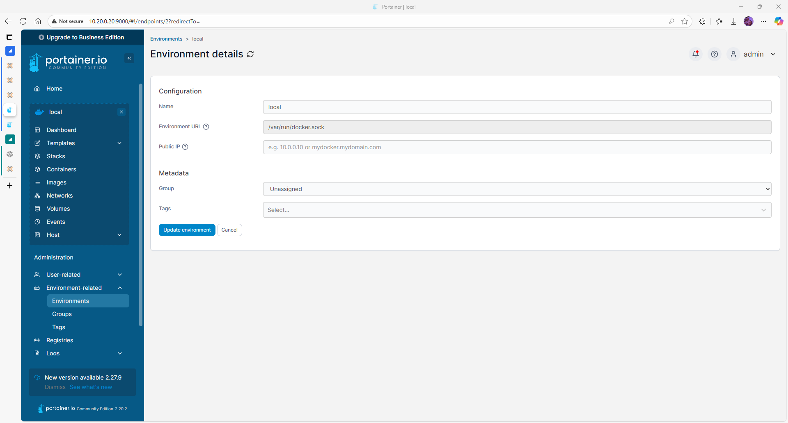

# Portainer 2.20.2 Installation

## Introduction

Step-by-step guide to install Portainer 2.20.2 CE on Debian 12.11 using Docker. Applies to VM environments within Proxmox VE.

## Prerequisites

- Debian 12.11 installed (VM on Proxmox)
- Root SSH access enabled
- Docker 28.3.3 installed and running
- Access to port 9443 and 8000

## Step 1 – Create Docker volume for Portainer

```bash
docker volume create portainer_data
```

Creates a persistent volume for Portainer data.

## Step 2 – Deploy Portainer container

```bash
docker run -d \
  -p 9443:9443 \
  -p 8000:8000 \
  --name portainer \
  --restart=always \
  -v /var/run/docker.sock:/var/run/docker.sock \
  -v portainer_data:/data \
  portainer/portainer-ce:2.20.2
```

Pulls and starts the official Portainer CE container with volume and Docker socket bind.


> Confirm that the container is running correctly.

## Step 3 – Access Web UI

1. Open browser: `https://<VM_IP>:9443`
2. Accept the browser TLS warning (self-signed cert)
3. Create admin password
4. Choose Docker environment (Local)


> Initial admin user creation screen.


> Select the Docker socket as your environment.

## Validation and Tests

- `docker ps` shows Portainer running
- Portainer UI loads and login is successful
- Local Docker environment is visible in the dashboard


> Example of the default dashboard view.

## Common Issues

| Symptom                 | Cause              | Fix                                        |
|------------------------|--------------------|---------------------------------------------|
| 404 or refused connection | Port not exposed   | Check `docker ps` and firewall rules        |
| Certificate warning     | Self-signed cert   | Proceed or replace with trusted certificate |

## Next Steps

See [configuration.md](configuration.md) for GUI steps and user settings.