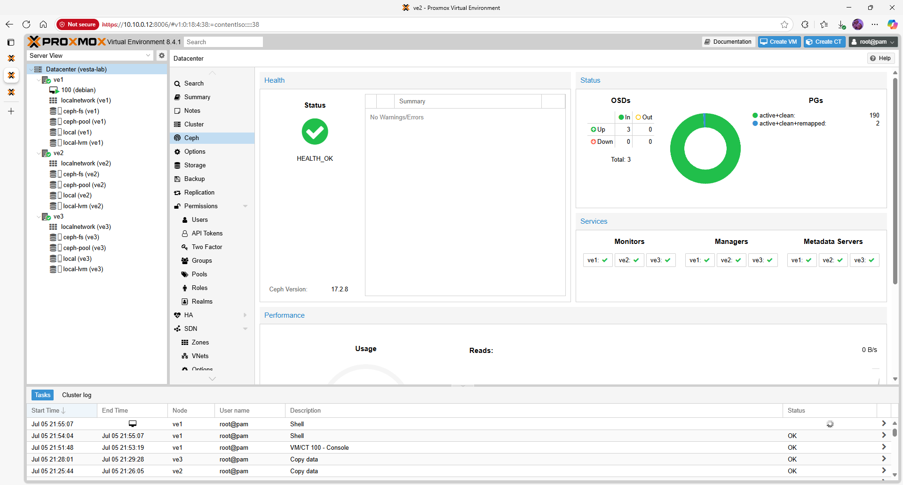
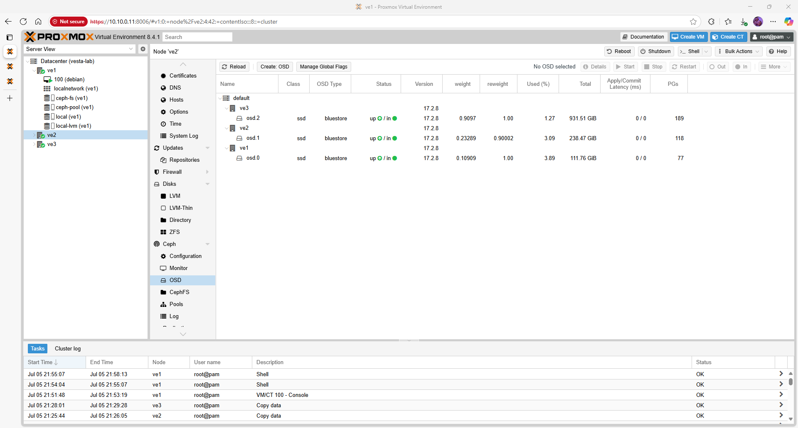
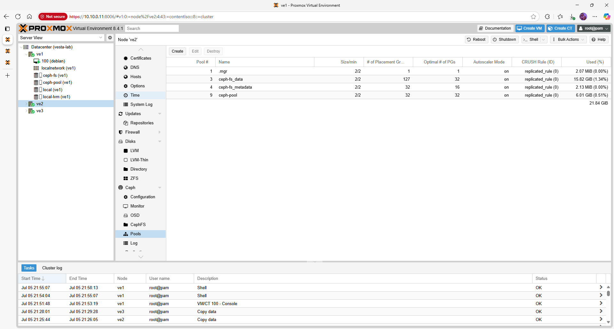
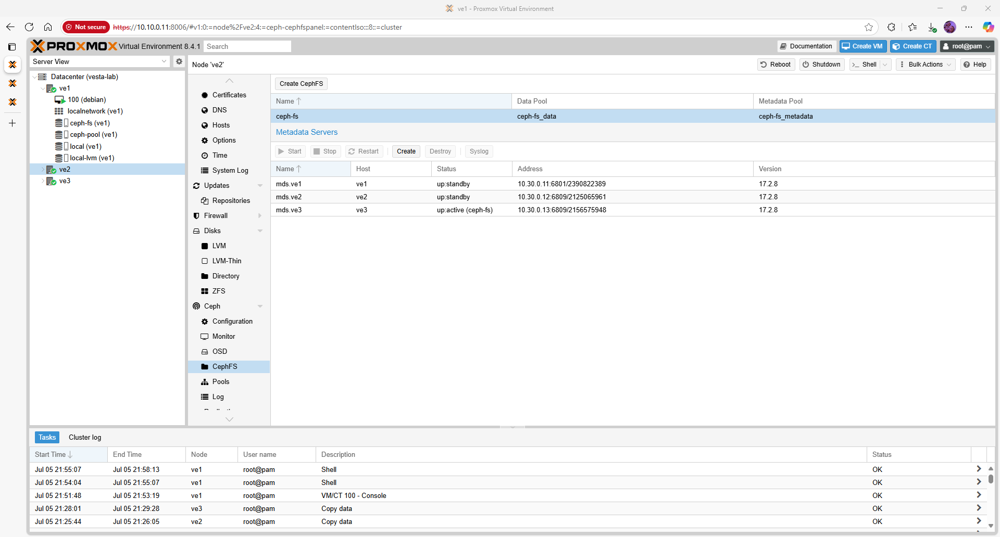

# Proxmox VE 8.4.1 – Ceph Storage

Ceph provides scalable, fault‑tolerant storage for VMs and containers.  This guide walks through installing Ceph on a three‑node Proxmox cluster, creating OSDs and pools, and adding CephFS for ISO/template storage.

## Quick‑view topology / matrix

| Node | Cluster VLAN (10.30.0.0/24) | Disks for OSDs | Notes |
|------|------------------------------|----------------|-------|
| **ve1** | 10.30.0.2 | `/dev/sda` (ssd) | System disk separate |
| **ve2** | 10.30.0.3 | `/dev/nvme0n1` (ssd) | — |
| **ve3** | 10.30.0.4 | `/dev/sda` (hdd) | Lower performance |

## Prerequisites

- A healthy Proxmox cluster with quorum (see [Cluster Setup](cluster.md)).
- At least one unused disk per node dedicated for Ceph OSDs.  All existing partitions on these disks will be destroyed.
- Sufficient network bandwidth on VLAN 30 for replication traffic.  Using jumbo frames (MTU 9000) is recommended.

## Step 1 – Install Ceph Packages

Install Ceph on every node using the no‑subscription repository:

```bash
pveceph install --repository no-subscription
```

This downloads and installs the Ceph `quincy` or `reef` packages from Proxmox repositories.  Confirm success by running `ceph --version`.

## Step 2 – Initialise the Ceph Cluster

Run the initialization once on **ve1**, specifying the cluster network (VLAN 30):

```bash
pveceph init --network 10.30.0.0/24
```

Then create the Monitor and Manager daemons on each node:

```bash
pveceph mon create
pveceph mgr create
```

In the web GUI, you will see the new monitors and managers appear under **Datacenter → Ceph**.



## Step 3 – Create OSDs

Prepare and assign disks to Ceph.  The table above lists one disk per node; adjust as needed.  For each disk run the following commands on the appropriate node:

```bash
sgdisk --zap-all /dev/sda       # remove existing partition table
wipefs -a /dev/sda             # erase filesystem signatures
pveceph osd create /dev/sda --crush-device-class ssd
```

Replace `/dev/sda` with the correct device (e.g. `/dev/nvme0n1` or `/dev/sdb`).  This command prepares the disk, adds it to the CRUSH map with the `ssd` or `hdd` class and starts the OSD daemon.



## Step 4 – Create Pools

Create at least one pool for virtual machine disks and another for backups.  For example:

```bash
pveceph pool create ceph-pool --application rbd
ceph osd pool set ceph-pool size 2
```

The `size` parameter determines the replication level.  A value of `2` means each block is stored on two different OSDs; increase to `3` for higher durability (requires at least three OSDs).



## Step 5 – Add CephFS for ISO and Templates

To store ISO files and container templates centrally, create a CephFS volume:

```bash
pveceph fs create cephfs --data-pool cephfs_data --metadata-pool cephfs_metadata
```

Then mount the filesystem in Proxmox by adding a storage entry.  Replace the monitor IPs with your cluster nodes:

```bash
pvesm add ceph-fs cephfs-store \
    --monhost 10.30.0.2 10.30.0.3 10.30.0.4 \
    --content iso,vztmpl,backup \
    --mountpoint /mnt/pve/ceph-fs
```

After running the command, verify the new storage appears in the web GUI under **Datacenter → Storage**.



## Step 6 – Validate the Setup

Check overall Ceph health and storage status:

```bash
ceph -s
pvesm status
```

The `ceph -s` output should indicate `HEALTH_OK`.  The `pvesm status` command lists the new RBD and CephFS stores as *available*.

## Troubleshooting

Refer to the [Ceph Troubleshooting](troubleshooting_ceph.md) page for solutions to common warnings (e.g. `401 Unauthorized` during installation, disks already in use or PG counts).

## Next steps / Links

Once storage is in place, enable automated failover by following the [High Availability](ha.md) guide.  Consult the official Proxmox Ceph documentation for detailed tuning and capacity planning [✔ verified https://www.virtualizationhowto.com/2022/08/proxmox-update-no-subscription-repository-configuration/].