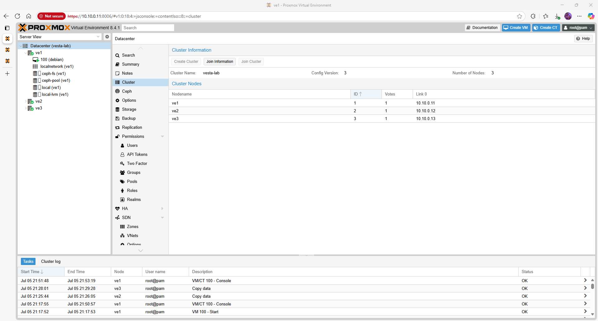
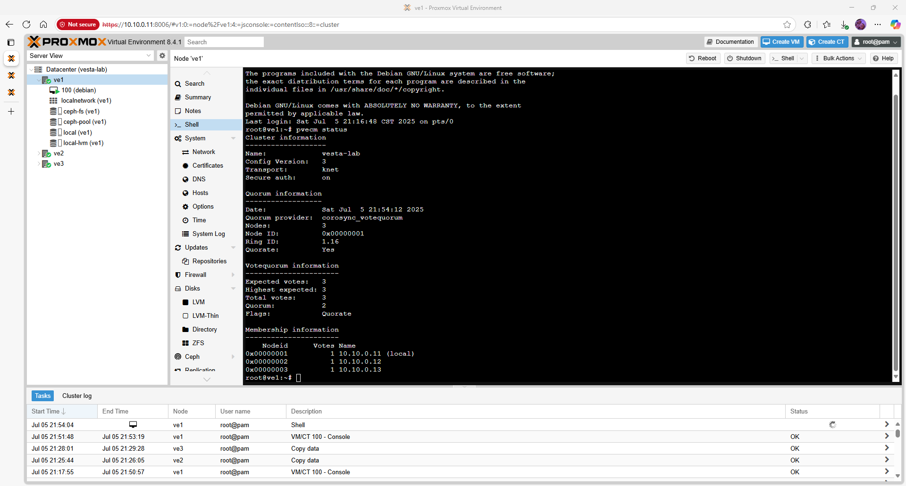

# Proxmox VE 8.4.1 – Cluster Setup

This guide explains how to create and join a Proxmox cluster.  A three‑node cluster ensures quorum and high availability for guest workloads.

## Quick‑view topology / matrix

| Node | Management IP | Cluster IP (VLAN 30) | Notes |
|------|---------------|----------------------|-------|
| **ve1** | 10.10.0.11    | 10.30.0.2           | Primary node; will create the cluster |
| **ve2** | 10.10.0.12    | 10.30.0.3           | Joins cluster as node ID 2 |
| **ve3** | 10.10.0.13    | 10.30.0.4           | Joins cluster as node ID 3 |

## Prerequisites

- All nodes have been installed with Proxmox VE 8.4.1 and networking configured as described in the [Networking guide](network.md).
- `/etc/hosts` lists all node names and addresses.
- Time synchronization (`timedatectl`) is enabled on every node.

## Step 1 – Initialize the Cluster on the First Node

Log into **ve1** and run the following command to create a new cluster named `vesta‑lab`.  The `--link0` argument specifies the management interface for Corosync communication.

```bash
pvecm create vesta-lab --link0 address=10.10.0.11,priority=1
```

You should see output indicating that the new cluster configuration has been written.  The `pvecm` tool will start Corosync and the pve‑cluster service on the first node.

## Step 2 – Join Additional Nodes

On **ve2** and **ve3**, join the cluster by specifying the IP address of the first node and a unique node ID.  Replace `<nodeid>` with `2` on ve2 and `3` on ve3:

```bash
pvecm add 10.10.0.11 --nodeid <nodeid>
```

If you previously initialized a local cluster on ve2 or ve3 by mistake, reset it before joining:

```bash
systemctl stop corosync pve-cluster
rm -rf /etc/corosync/* /var/lib/pve-cluster/*
systemctl start pve-cluster
```

After joining, `pvecm nodes` will list all members with their assigned IDs and votes.



## Step 3 – Regenerate Certificates (Optional)

To ensure that all nodes have synchronized SSL certificates, run the following commands on **ve1** after all members have joined:

```bash
pvecm updatecerts --force
systemctl restart pveproxy pvedaemon
```

This forces a certificate refresh and restarts the web proxy and API daemons.

## Step 4 – Validate Cluster Status

Run `pvecm status` on any node to verify cluster health:

```bash
pvecm status
```

The output should show `Quorate: Yes` and list all three nodes.  If quorum is not established, double‑check time synchronization, firewall rules and the cluster network.



## Validation & Smoke Tests

- **Node visibility** – Each node appears in the web GUI under **Datacenter → Cluster** with status *Online*.
- **Quorum** – `pvecm status` reports `Quorate: Yes` and `Nodes: 3`.
- **Migration** – Create a test VM and migrate it between nodes via **VM → Migration** to confirm cluster operation.

## Troubleshooting

Common cluster issues (nodes stuck in old clusters, Corosync errors, certificate mismatches) are documented in the [Cluster Troubleshooting](troubleshooting_cluster.md) page.

## Next steps / Links

With the cluster operational, continue with the [Ceph Storage](ceph.md) guide to configure shared storage across the nodes, or enable automatic failover via [High Availability](ha.md).