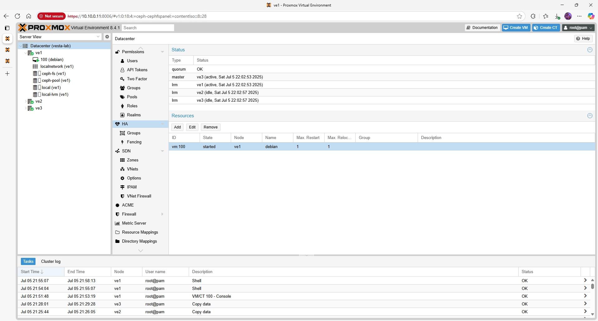

# Proxmox VE 8.4.1 – High Availability (HA)

High Availability allows critical virtual machines to restart automatically on another node if a host fails.  This guide assumes you have a three‑node cluster and shared storage (Ceph RBD or CephFS) configured.

## Quick‑view overview

In a Proxmox VE HA cluster, a *Cluster Resource Manager* monitors the health of nodes and starts HA‑enabled services on another node when a failure is detected.  Fencing (hardware watchdogs) is recommended for production but optional in a lab environment.

## Prerequisites

- A Proxmox cluster with **at least 3 nodes** and quorum (see [Cluster Setup](cluster.md)).
- Shared storage (e.g. Ceph RBD, CephFS) so VMs can run on any node.
- Time synchronization across all nodes.
- Optional: a fencing/watchdog device for reliable node isolation.

## Step 1 – Verify Cluster Status

Ensure the cluster is healthy before enabling HA:

```bash
pvecm status
```

The command should show `Quorate: Yes` and all nodes listed.  Resolve any networking or quorum issues before proceeding.

## Step 2 – Enable the HA Manager Services

The HA agent (`pve-ha-crm`) and local resource manager (`pve-ha-lrm`) must be running on all nodes.  Check their status and enable them if necessary:

```bash
systemctl status pve-ha-lrm
systemctl status pve-ha-crm

systemctl enable --now pve-ha-lrm
systemctl enable --now pve-ha-crm
```

These services coordinate failover actions and track which node owns each HA resource.

## Step 3 – Mark VMs or Containers as HA‑Managed

Only VMs or containers flagged for HA will be automatically restarted.  You can configure HA either via the GUI or the CLI.

### CLI

Add a VM with ID 100 to HA management:

```bash
ha-manager add vm:100
```

List HA‑managed services:

```bash
ha-manager status
```

### GUI

Navigate to **Datacenter → HA** and click **Add**.  Select the VM or container and set the desired **Group** and **Failover Mode**.  Groups define which nodes are eligible to run the resource.  The most common mode is *migrate*, which starts the VM on another node.

| Menu path                     | Action                                                | Purpose                                     |
|-------------------------------|-------------------------------------------------------|---------------------------------------------|
| Datacenter → HA → Add         | Choose VM/LXC ID, select group and failover settings | Enable HA management for a resource        |
| Datacenter → HA → Groups      | Create groups of nodes                               | Control where HA resources may run          |
| Datacenter → HA → Status      | View current state of HA resources                   | Monitor failover and recovery operations    |

The screenshot below shows the HA status page with one VM registered for high availability:



## Step 4 – Test HA Failover

To verify HA, simulate a node failure and watch the VM automatically start on another node.  In a lab, the simplest test is to stop the cluster stack on one node:

```bash
systemctl stop pve-cluster
```

Alternatively, reboot the node or pull its network cable (in a controlled environment).  Monitor `ha-manager status` and the web GUI to see the VM migrate and restart.

## Validation & Smoke Tests

- **Service Migration** – When a node goes offline, HA‑enabled VMs should restart on a remaining node within a few minutes.
- **Group Constraints** – If a resource is restricted to a group, verify that it does not start on non‑group nodes.
- **State Recovery** – After the failed node returns, the VM continues to run on its new host.  Migration back occurs only if configured.

## Troubleshooting

- If HA resources remain stopped after a failure, ensure the HA services (`pve-ha-crm` and `pve-ha-lrm`) are running on all nodes.
- Use `ha-manager crm-log` to view recent cluster events and identify why a resource was not restarted.
- For production, implement STONITH/fencing devices so that failed nodes are powered off and cannot corrupt shared storage.

## Next steps / Links

HA ensures service continuity but does not replace backups.  To protect your data, integrate **Proxmox Backup Server** or another backup solution.  Return to [Ceph Storage](ceph.md) for advanced tuning, or explore other services in the Vesta Lab portfolio.