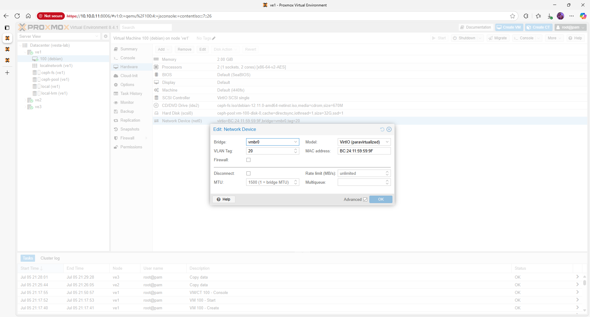

# Proxmox VE 8.4.1 – Networking (Bare‑Metal)

This page describes how to configure bridges and VLAN tagging on each Proxmox host.  A consistent network layout is critical for cluster communication and Ceph traffic.

## Quick‑view topology / matrix

| VLAN ID | Name     | Purpose                     | CIDR          |
|---------|----------|-----------------------------|---------------|
| **10**  | mgmt     | Proxmox GUI / SSH          | 10.10.0.0/24  |
| **20**  | services | Guest VM/LXC networks      | 10.20.0.0/24  |
| **30**  | cluster  | Corosync & Ceph replication | 10.30.0.0/24  |
| **40**  | backups  | Backup traffic             | 10.40.0.0/24  |

## Prerequisites

- Ensure your physical switches trunk all required VLANs to the Proxmox hosts.  Untagged (native) VLAN 10 is used for management in this example.
- Identify the network interface name connected to your switch (e.g. `eno1` or `eth0`).  You can list interfaces with `ip link`.
- Decide which VLANs will carry Ceph and cluster traffic; high‑throughput networks benefit from jumbo frames (MTU 9000).

## Step 1 – Create a VLAN‑aware Bridge

Edit `/etc/network/interfaces` on each node and create a Linux bridge named `vmbr0` that attaches to your physical NIC.  Enable VLAN‑aware mode so that sub‑interfaces can be defined on top:

```bash
auto lo
iface lo inet loopback

auto eno1
iface eno1 inet manual

auto vmbr0
iface vmbr0 inet manual
        bridge‑ports eno1
        bridge‑stp off
        bridge‑fd 0
        bridge‑vlan‑aware yes
        bridge‑vids 2‑4094
```

This defines a bare bridge without any IP address.  The `bridge‑vlan‑aware` flag allows us to tag VLANs on the bridge directly.  After saving, restart the networking service or reboot to apply changes.


## Step 2 – Define VLAN Subinterfaces

For each VLAN, create a logical interface on `vmbr0` with a `.VLAN_ID` suffix and assign an IP address if needed.  Below is an example for the management network.  Repeat the stanza for other VLANs, changing the VLAN ID and IP accordingly:

```bash
auto vmbr0.10
iface vmbr0.10 inet static
        address 10.10.0.11/24
        gateway 10.10.0.1
        dns‑servers 10.0.0.102 1.1.1.1
        vlan‑raw‑device vmbr0
```

Replace `10.10.0.11` with the correct IP for each node.  For VLANs used exclusively for Ceph or cluster traffic, omit the `gateway` line since they are non‑routed subnets.

Below is a screenshot of the VLAN‑tagged interface configuration in the Proxmox GUI:



### GUI configuration

If you prefer the web interface, navigate to **Datacenter → Node → Network** and click **Create → Linux Bridge**.  Enter `vmbr0` as the name, select your NIC (e.g. `eno1`) and tick **VLAN aware**.  Next, create VLANs by clicking **Add → Linux VLAN**, choose the bridge, and enter the VLAN ID and IP settings.

| Menu path                                    | Action                                       | Purpose                                      |
|----------------------------------------------|----------------------------------------------|----------------------------------------------|
| Datacenter → Node → Network → Create Bridge  | Create `vmbr0` with VLAN awareness           | Base bridge for all tagged networks          |
| Datacenter → Node → Network → Add VLAN       | Add `vmbr0.10`, `vmbr0.20`, etc.             | Define per‑VLAN interfaces and IP addresses |
| Datacenter → Node → Network → Reboot required | Apply changes                               | Restart services to apply network changes   |

## Step 3 – Validate Connectivity

After applying the configuration, verify network connectivity:

```bash
ip addr show vmbr0
ip addr show vmbr0.10
ping -c3 10.10.0.12
ping -c3 10.30.0.3
```

All nodes should be reachable on the management and cluster VLANs.  Use `ip link` to check the MTU; set it to 9000 on both the host NIC and switch if jumbo frames are desired.


## Troubleshooting

- If `bridge‑vlan‑aware` is not enabled, tagged interfaces (`vmbr0.10`) will not forward traffic.  Recheck the configuration and restart networking.
- Ensure the trunk ports on the switch allow all required VLANs and that native VLANs are correctly set.
- For Ceph and Corosync, avoid mixing MTU sizes on different paths.  Use `ip link set dev <iface> mtu <value>` to adjust.

## Next steps / Links

With networking configured, proceed to the [Cluster Setup](cluster.md) page to form a three‑node Proxmox cluster.  For Ceph storage configuration, see the [Ceph Storage guide](ceph.md).